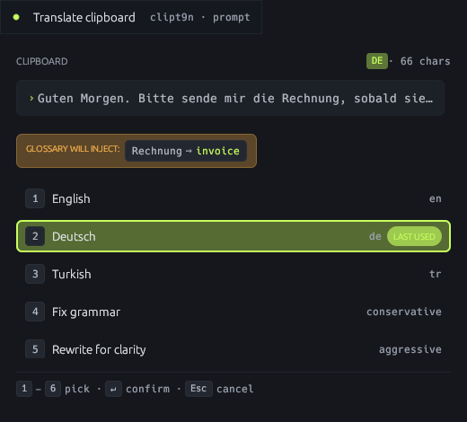
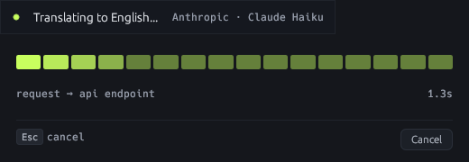
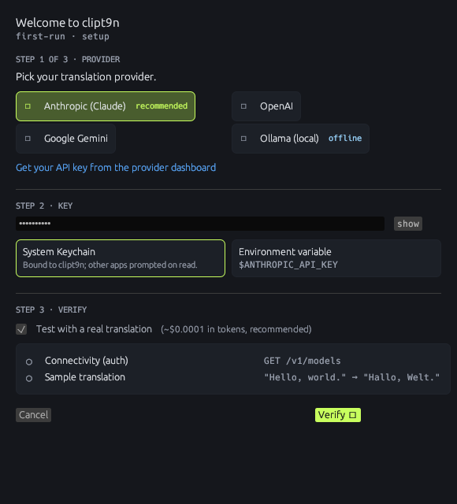
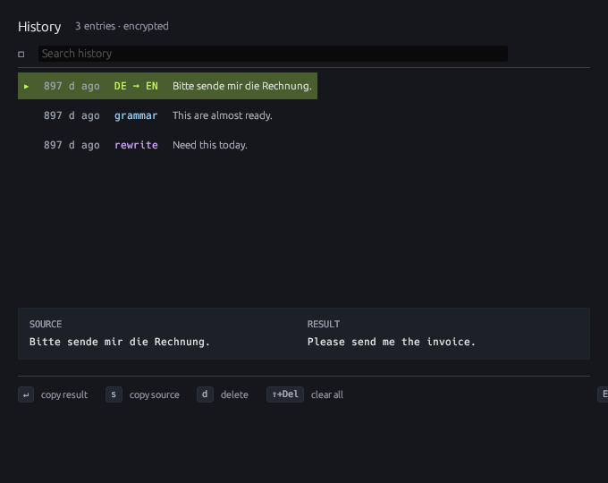

# clipt9n

clipt9n is a small clipboard translation app for people who translate and rewrite text throughout the day.

Copy some text, press `Cmd+Option+T`, choose what you want, and clipt9n replaces your clipboard with the translated or rewritten result. It lives in the menu bar, keeps a local history, supports glossaries, and works with several AI providers.

You can also select text in another app and press `Cmd+Option+Y` to use that selection as the source text. clipt9n still copies only the result to your clipboard; it does not paste or replace text for you.



## What You Can Do With It

- Translate whatever is on your clipboard into your favorite languages.
- Fix grammar without changing the meaning.
- Rewrite text for clarity.
- Run a custom instruction, such as "make this more formal" or "summarize in one sentence".
- Keep terminology consistent with a local glossary.
- Reopen previous results from encrypted local history.
- Use the menu bar when you do not want to use the keyboard shortcut.

## How It Works

1. Copy text from any app.
2. Press `Cmd+Option+T`.
3. Pick one of the numbered actions.
4. The result is copied back to your clipboard.
5. Paste it wherever you need it.

By default, slots `1`, `2`, and `3` translate to English, Deutsch, and Turkish. Slot `4` fixes grammar, slot `5` rewrites for clarity, and slot `6` lets you type a custom instruction.

While clipt9n is working, it shows an in-progress view with a cancel button.



When the request finishes, clipt9n shows a metadata-only completion notification and copies the result to your clipboard.

## First Launch

On first launch, clipt9n opens a setup wizard. Choose a provider, paste your API key, decide where the key should be stored, and optionally verify that the provider works.



Supported providers:

- Anthropic Claude
- OpenAI
- Google Gemini
- Ollama for local models

On macOS, clipt9n can store API keys in Keychain. If Keychain is not available, it can use an environment variable or the local fallback described in the app.

## Menu Bar

clipt9n runs quietly in the menu bar. From the menu, you can:

- Translate the clipboard.
- Open history.
- Open the glossary file.
- Reload the glossary after editing it.
- Open settings.
- Re-run the setup wizard.
- Hide the menu bar icon.
- Quit the app.

If you hide the icon and later want it back, launch clipt9n with:

```bash
clipt9n --show-tray
```

## History

clipt9n keeps a local history so you can reopen, search, copy, delete, or clear past results.



History is designed to stay private:

- Source text and result text are encrypted locally.
- Provider, action type, language, and timing metadata are stored in plain text.
- The history database stays on your machine.
- If text storage is disabled, clipt9n stores metadata only.

## Glossary

Use the glossary when certain terms must always be translated the same way. This is useful for product names, domain-specific vocabulary, acronyms, customer names, or words that should stay unchanged.

Create or edit `glossary.toml` in the clipt9n config folder:

```toml
[[entry]]
source = "Smart Table"
target = "Smart Table"
languages = ["*"]

[[entry]]
source = "Vorgang"
target = "case"
languages = ["de->en"]

[[entry]]
source = "GIP"
target = "GIP"
languages = ["*"]
note = "Always preserve as-is"
```

The app notices matching glossary terms before sending a request and includes them in the instruction to the provider. Use **Reload glossary** from the menu bar after editing the file.

## macOS Permissions

The global keyboard shortcut needs Accessibility permission on macOS.

If `Cmd+Option+T` does not open clipt9n:

1. Open System Settings.
2. Go to Privacy & Security.
3. Open Accessibility.
4. Enable clipt9n.
5. Relaunch the app.

The menu bar actions still work even if the keyboard shortcut is not available.

## Install On macOS

Build the app from source:

```bash
git clone https://github.com/egeozcan/clipt9n.git
cd clipt9n
scripts/package-macos.sh
```

Then copy the built app into Applications:

```bash
cp -R target/release/bundle/osx/clipt9n.app /Applications/
```

The packaging script builds and verifies a universal app containing both Apple Silicon and Intel binaries. Local builds receive only an ad-hoc signature; they are not Developer ID signed or notarized. macOS may ask you to confirm the first launch. Right-click the app, choose **Open**, and confirm.

## Install On Linux

The Linux package requires `xdg-open` for opening files and `xdotool` for
selected-text copy and inline replacement on X11. Install both with your
distribution package manager before packaging:

```bash
scripts/package-linux.sh
```

`xdotool` cannot automate native Wayland applications. On a native Wayland
session, clipt9n explicitly disables selected-text copy and inline replacement
with an actionable error; clipboard-only translation remains available. Log in
to an X11 session to use those automation shortcuts until a portal or
compositor adapter is implemented.

## Command Line Use

clipt9n can also run without the menu bar UI. It reads your clipboard, performs the requested action, and writes the result back to your clipboard.

```bash
clipt9n --translate-to=de
clipt9n --fix-grammar
clipt9n --rewrite
clipt9n --custom "make this more diplomatic"
```

## Configuration

Pick **Settings…** from the menu bar to edit the configuration in a window:
provider and model, the API key and where it is stored, the five language
slots, all four hotkeys, and the prompt/glossary/history behavior.

Saving applies immediately — the provider is rebuilt in place, so a new
key or model takes effect on the next translation. Two changes need a
relaunch and say so in the window: hotkey edits (registered once at
startup) and turning history on or off.

If the menu bar icon is hidden, reach the same window with:

```bash
clipt9n --settings
```

Everything the window covers, plus prompt-template overrides, also lives
in the config file. On macOS, the default path is:

```text
~/Library/Application Support/clipboard-translator/config.toml
```

Example:

```toml
[provider]
type = "anthropic"
model = "claude-haiku-4-5"
base_url = "https://api.anthropic.com/v1"
timeout_seconds = 30

[provider.api_key]
source = "keychain"

[languages.slot_1]
label = "English"
code = "en"

[languages.slot_2]
label = "Deutsch"
code = "de"

[languages.slot_3]
label = "Turkish"
code = "tr"

[hotkey]
modifier = "cmd"
option = true
shift = false
key = "T"
enabled = true

[hotkey.selection]
modifier = "cmd"
option = true
shift = false
key = "Y"
enabled = true
copy_delay_ms = 80

[hotkey.history]
modifier = "cmd"
option = true
shift = false
key = "H"
enabled = true

[history]
enabled = true
store_text = true
```

## Troubleshooting

**The shortcut does not open the window**

Check macOS Accessibility permission. If clipt9n is already enabled, relaunch the app. You can still use the menu bar while checking permissions.

**The setup wizard keeps appearing**

The app could not find a usable API key. Open **Re-run setup wizard** from the menu bar and verify the provider settings.

**Notifications do not appear**

Open System Settings, go to Notifications, choose clipt9n, and make sure notifications are allowed.

**Translations are not using my glossary**

Check that `glossary.toml` is valid TOML, that the language pair matches the current translation, and then choose **Reload glossary** from the menu bar.

**The menu bar icon is hidden**

Run:

```bash
clipt9n --show-tray
```

## Uninstall

Quit clipt9n, then remove the app:

```bash
rm -rf /Applications/clipt9n.app
```

To remove local data as well, delete the config folder:

```bash
rm -rf "$HOME/Library/Application Support/clipboard-translator"
```

This removes settings, glossary files, history, and locally stored keys.
